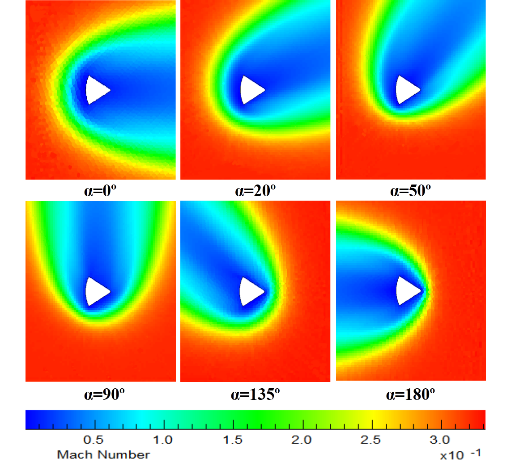

# DSMC Simulation for Apollo Capsule
+ Altitude: 105km, Speed: 9.6km/s
+ Geometry data from American Institute of Aeronautics and Astronautics Paper 2006-3577
+ Program from Bird's DS3V, [More Details](http://www.gab.com.au/page5.html)
+ Results,Mach number
  + 
